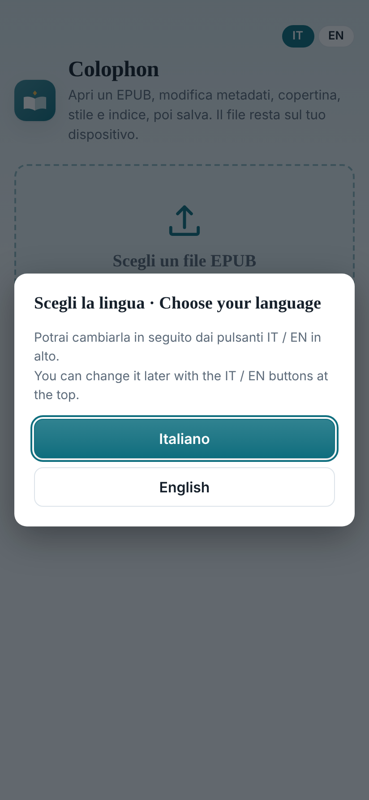
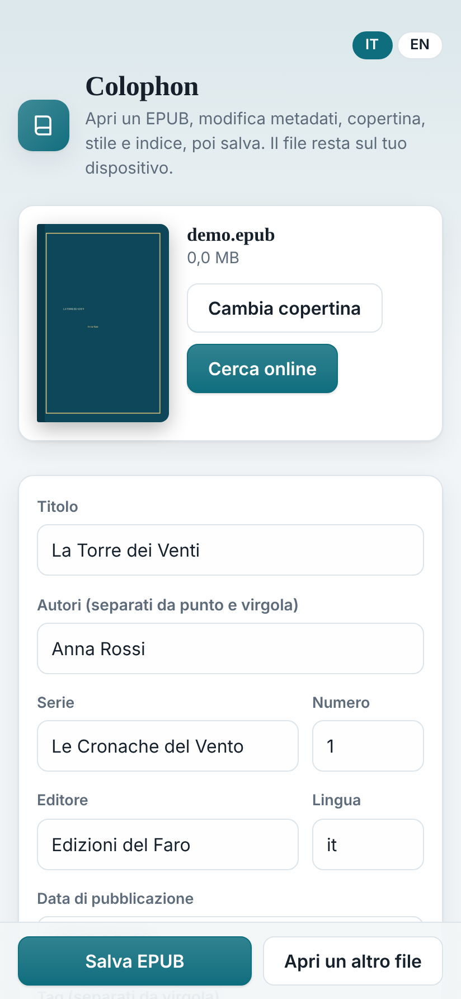
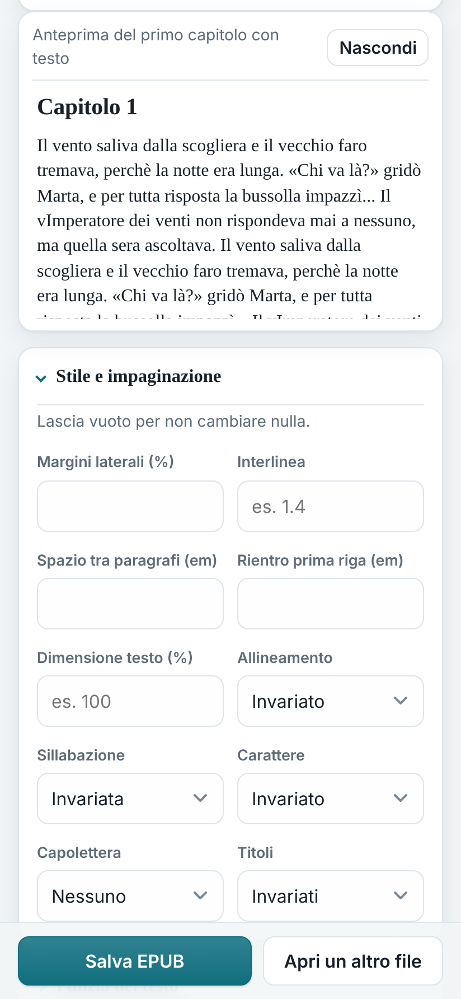
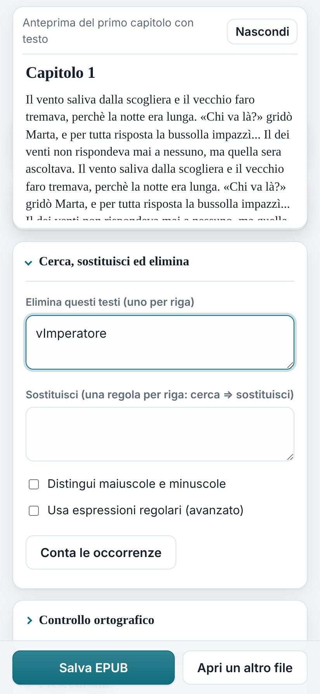
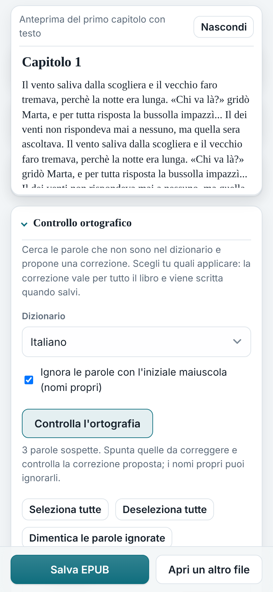
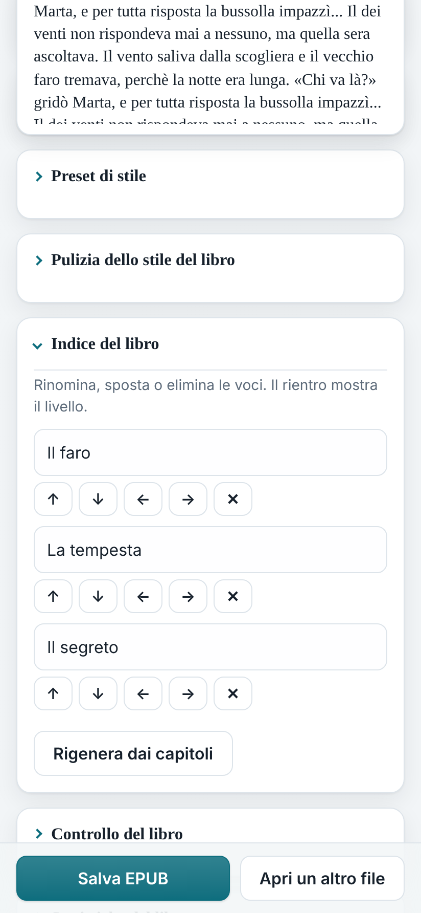
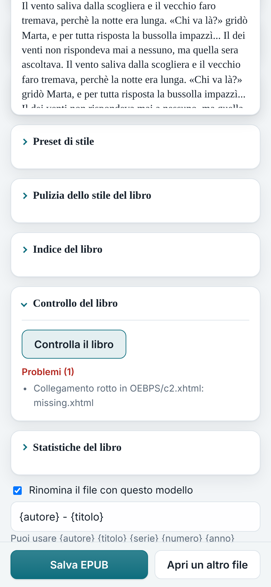

# Colophon

**Colophon** è una web app (PWA) gratuita per modificare i **metadati**, la **copertina**, lo **stile** e l'**indice** dei file EPUB, direttamente dal browser. Pensata come alternativa leggera alle funzioni di modifica di Calibre, utilizzabile da Chromebook, Android e PC.

**I tuoi libri non vengono mai caricati su nessun server**: i file sono letti, modificati e salvati sul tuo dispositivo.

## Screenshots

<table>
  <tr>
    <td align="center"> Scelta della lingua</td>
    <td align="center"> Metadati e copertina</td>
    <td align="center"> Stile e anteprima</td>
    <td align="center"> Cerca, sostituisci ed elimina</td>
  </tr>
  <tr>
    <td align="center"> Controllo ortografico</td>
    <td align="center"> Indice del libro</td>
    <td align="center"> Controllo del libro</td>
    <td></td>
  </tr>
</table>

*Gli screenshot usano un libro di prova creato per l'occasione.*

## Cosa puoi fare

**Metadati e copertina**
- Modifica titolo, autori, serie e numero, editore, lingua, data, tag e descrizione
- Sostituisci la copertina (JPG o PNG)
- **Cerca online** titolo, autore e copertina (Google Books, con Open Library come alternativa)
- Rinomina il file con un modello, per esempio `{serie} {numero} - {titolo}` (disponibili `{autore}`, `{titolo}`, `{serie}`, `{numero}`, `{anno}`)

**Stile e impaginazione** *(con anteprima del primo capitolo che si aggiorna mentre cambi le opzioni)*
- Margini laterali, interlinea, spazio tra paragrafi, rientro della prima riga, dimensione del testo
- Allineamento (a sinistra o giustificato), sillabazione, carattere (Serif o Sans serif)
- Capolettera dopo i titoli, titoli centrati o a sinistra

**Pulizia del testo**
- Virgolette caporali «…» o inglesi “…”, apostrofi tipografici
- Tre puntini che diventano …, spazi doppi, spazio prima della punteggiatura
- Dialoghi con il trattino lungo (—)
- **Cerca, sostituisci ed elimina** in tutto il libro (anche con espressioni regolari), con conteggio delle occorrenze

**Struttura del libro**
- **Controllo ortografico:** trova le parole non presenti nel dizionario, italiano o inglese (per esempio errori di scansione come "vImperatore"), mostra la frase in cui compaiono, propone una correzione e lascia scegliere a te quali applicare a tutto il libro. Funziona offline e può ignorare i nomi propri
- **Pulizia dello stile del libro:** togli colori, caratteri e dimensioni imposti dall'editore, oppure tutti gli stili
- **Indice:** rinomina, sposta, cambia livello o elimina le voci; rigenera l'indice dai capitoli
- **Controllo del libro:** segnala file mancanti o non dichiarati, collegamenti e immagini rotti, codice non valido, dati mancanti
- **Statistiche:** capitoli, parole e tempo di lettura stimato

**Comodità**
- **Italiano e inglese:** al primo avvio l'app propone la lingua rilevata dal dispositivo (italiano o inglese, altrimenti inglese) e chiede di confermarla; si può cambiare in qualsiasi momento con i pulsanti IT / EN in alto
- **Preset di stile:** salva le tue impostazioni e riapplicale ad altri libri
- Funziona anche offline dopo la prima apertura (tranne la ricerca online)

## Installarla come app

1. Apri l'indirizzo dell'app con **Chrome**.
2. Dal menu ⋮ scegli **Installa app** (o "Aggiungi a schermata Home").
3. Troverai l'icona tra le tue app, come una normale applicazione.

## Come si usa

1. Tocca **Scegli un file EPUB** e seleziona il libro (anche da Google Drive, tramite il selettore file del dispositivo).
2. Modifica i campi e le opzioni che ti servono. Le sezioni vuote non cambiano nulla.
3. Premi **Salva EPUB**: scarichi un nuovo file, l'originale non viene toccato.

> Consiglio: provala sempre su una copia del libro prima di sovrascrivere l'originale.

## Limiti noti

- La ricerca e la sostituzione agiscono dentro un singolo blocco di testo: una frase interrotta da un grassetto o da un corsivo non viene trovata.
- Alcune app di lettura (per esempio Kindle o Apple Books) ignorano margini e carattere se l'utente ha impostato i propri.
- La ricerca online richiede connessione e dipende da servizi esterni, che possono rifiutare temporaneamente le richieste. A volte la copertina non si riesce a scaricare: in quel caso puoi scegliere tu l'immagine.
- Il controllo del libro segnala i problemi ma non li corregge.
- Il controllo ortografico usa un dizionario, non un'intelligenza artificiale: i suggerimenti sono quelli del dizionario. Non conosce i nomi propri e i termini inventati (vanno ignorati) e per impostazione predefinita salta le parole con l'iniziale maiuscola, quindi un errore a inizio frase può sfuggire. Non verifica la grammatica.
